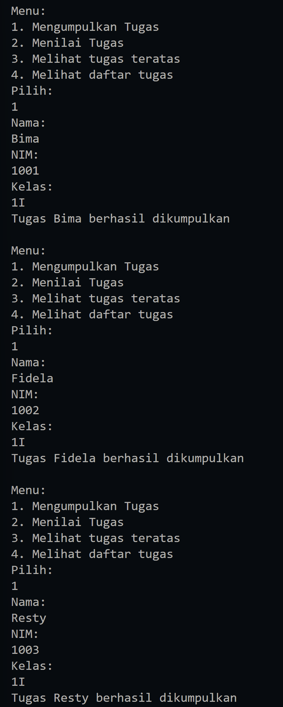
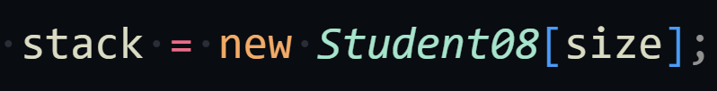
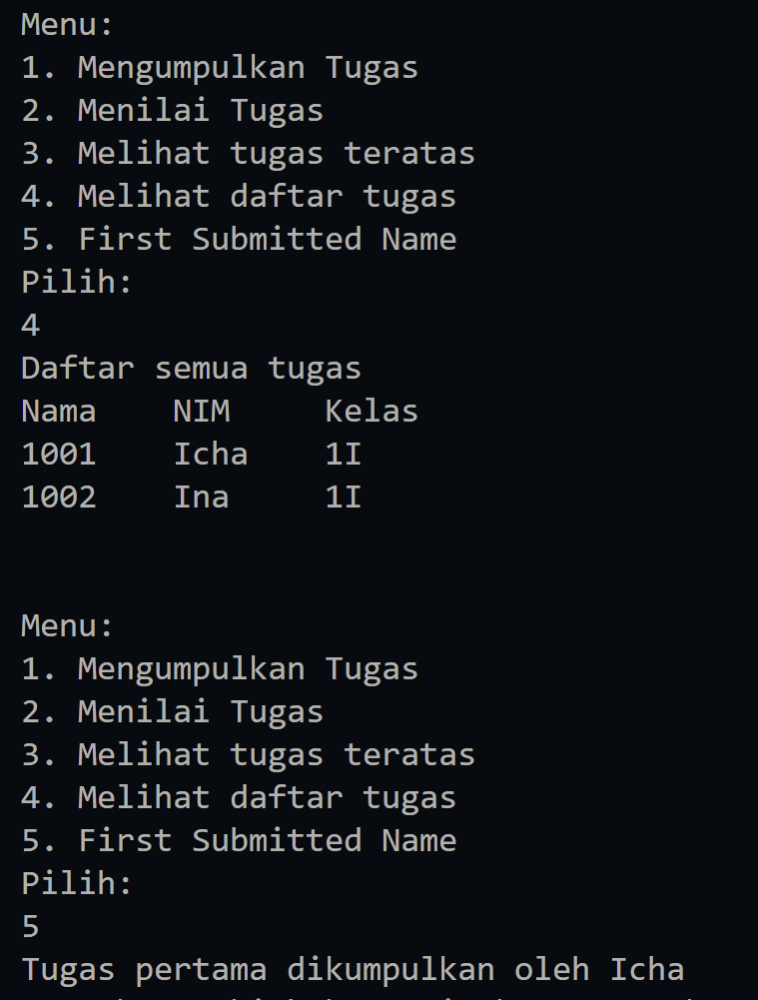
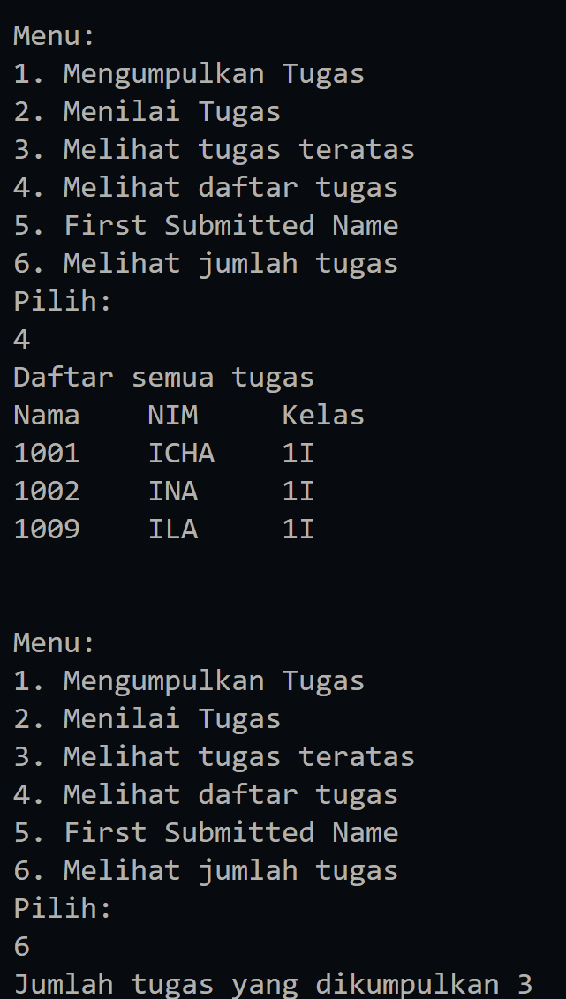
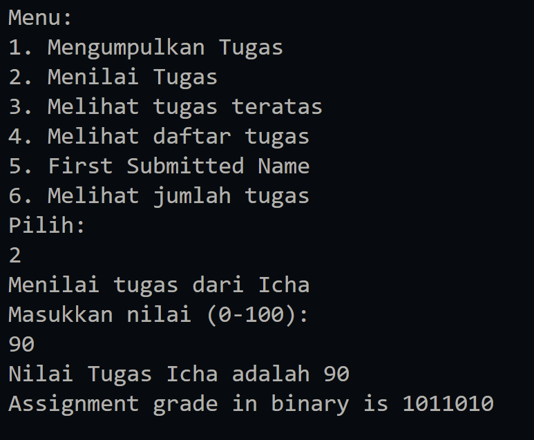
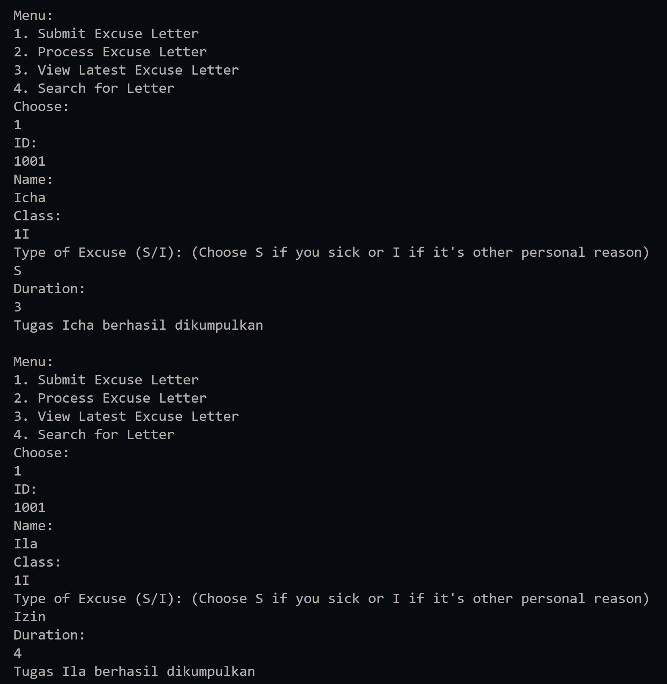

|  | Algorithm and Data Structure |
|--|--|
| NIM |  244107020023|
| Nama |  Dewi Chalissa Rania |
| Kelas | TI - 1I |
| Repository | [link] (https://github.com/ichaxpro/Algoritma-dan-Struktur-Data.git) |

# Labs #10 Stack

## 2.1 Experiment 1 - Assignment Submission
### 2.1.2 Verification Experiment Result
The solution is implemented in sorting08.java, and sortingMain08.java. Below is screenshot of the result.


_assignment1.png)
_assignment1.png)

### 2.1.3 Question
*Brief explanaton:* 
1.  because stack use rule of LIFO (Last in First Out), usually in assignment management system, the most recently added assugnment is the one that require action first. So, using stack will allow the system to prioritize the most recent assignment
2. the difference between push() and pop() is push() to add an element to stack while pop() is to remove the top element of stack.
3. isFull() is to check if the stack is full of not and push() is to add an element to stack if we add an element without checking the stack full or not it will be stack overflow. Stack overflow is a condition where stack exceeds its allocated memory or capacity.
4. in this implementation, this program can store 5 students


5. 
Changes that I make to modify the program is 
- Add method in StudentAssignmentStack08

``` java
public Student08 first(){
    if (!isEmpty()){
      return stack[0]; // First student is at index 0
    } else {
      System.out.println("There is no data in Stack!!");
      return null;
    }
  }
```
This method simply returns the first student (the bottom-most element in the stack) by accessing the element at index 0.

- Add menu in StudentDemo08 

```java
System.out.println("5. Melihat tugas pertama");
```
- Call method in switch case number 5
``` java
case 5:
        Student08 first = stack.firstSubmitted();
        if(first !=null){
          System.out.println("Tugas pertama dikumpulkan oleh " + first.name);
        }
        break;
```
6.  
- Add method count in AssignmentStack08 
```java
public int count(){
    return top+1;
  }
```
Because in here, index start at 0, top+1 will give the total assignment

- Add menu in StudentDemo08 and call the method in witch case number 6

7. Stack -> Dinamic data structure concept that follows LIFO (Last in First Out) 
   Real World Application is redo or undo in word processor.
## 2.2.Experiment 2- Convert Assignment Grade to Binary
### 2.2.3 Verification Experiment Result
 Below is screenshot of the result.



### 2.2.4 Question
1. Workflow of convertToBinary Method
- Create stack object using class ConversionStack08
- Loop 1 : this loop continues until grade becomes 0 and each iteartion it will takes the remainder of grade divided by 2, push the remainder into the stack
and updaates the grades by dividing it by 2.
- Loop 2: The binary digit are popped form the stack adn each digit is added to the binary String.
- The final binary string is returned.
2. the result will be the same bacause loop with condition (grade > 0) or (grade !=0 ) it will keep running as long as the number is not zero and stops when grade reaches zero. but if we add negative number it will give difference result because if we use loop (grade>0) it will false but (grade !=0 ) it will still true so that's the difference.

## 2.3 Assignment
### 2.3.1 Verification Experiment Result
The solution is implemented in ExcuseLetter08.java, ExcuseLetterStack.java, and ExcuseLetterDemo.java. Here's the screenshot of the result.


.png)


