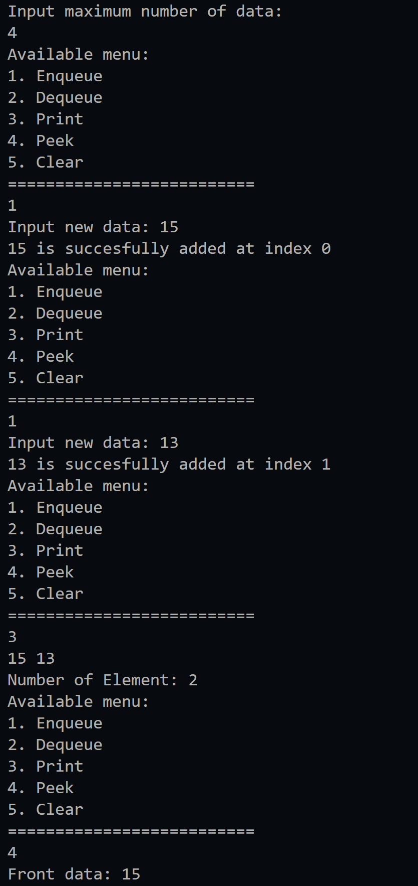
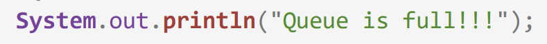
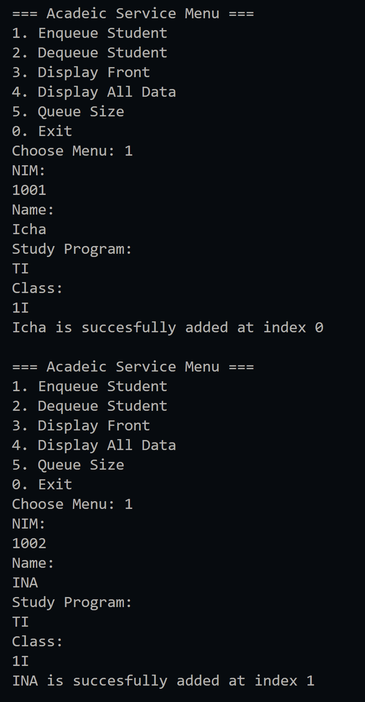
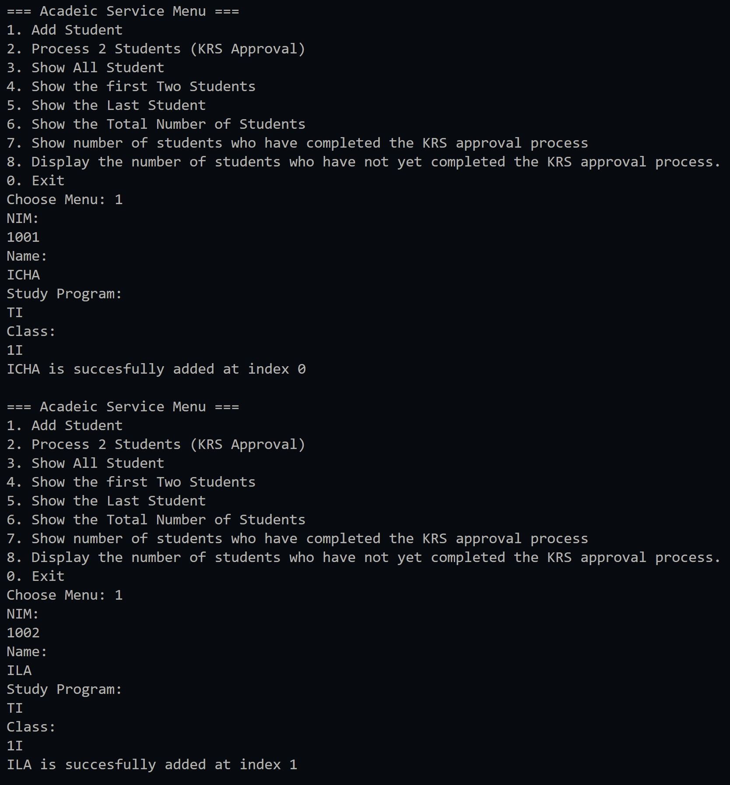
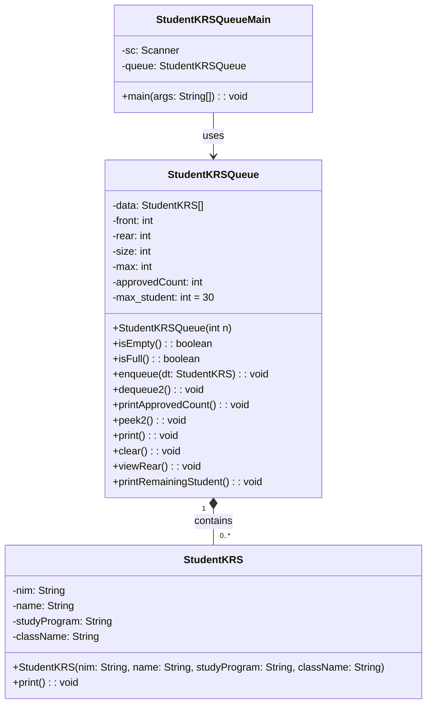

|  | Algorithm and Data Structure |
|--|--|
| NIM |  244107020023|
| Nama |  Dewi Chalissa Rania |
| Kelas | TI - 1I |
| Repository | [link] (https://github.com/ichaxpro/Algoritma-dan-Struktur-Data.git) |

# Labs #11 Queue

## 2.1 Experiment 1 - Queue Basic Operations
### 2.1.2 Verification Experiment Result
The solution is implemented in Queue.java and QueueMain.java. Below is screenshot of the result.


.png)


### 2.1.3 Question
*Brief explanaton:* 
1. Because -1 values in front and rear means that there is no data in queue and it applies the same when we initialize the value of size to 0. 
2. the code is where condition of rear when we add data in queue is in the back of queue, the rear will be in index zero
3. this code is a condition where we remove the data in queue and the data is located in the back of queue, if we removed it the front will be in index zero
4. because front is not always in index zero if we removed data it will be move to the other index.
5. n a circular queue, the array has a fixed size (max). When the index reaches the end (max - 1), it should wrap back to 0 instead of going out of bounds. Using (i + 1) % max ensures the index stays within valid limits and loops back to the start, maintaining the circular structure.
6. 
7. 
``` java
package Jobsheet11;

public class Queue {
  int[] data;
  int front, rear, size, max;

  public Queue(int n){
    max = n;
    data = new int[max];
    size = 0;
    front = rear = -1;
  }

  public boolean isEmpty(){
    if (size == 0){
      return true;
    }else{
      return false;
    }
  }
  public boolean isFull(){
    if (size == max) {
      return true;
    }else{
      return false;
    }
  }
  public void peek(){
    if (!isEmpty()){
      System.out.println("Front data: " + data[front]);
    }else{
      System.out.println("Queue is empty!!!");
      System.exit(1);
    }
  }
  public void print(){
    if (!isEmpty()) {
      int i = front;
      while (i != rear) {
        System.out.print(data[i]+" ");
        i = (i+1)%max;
      }
      System.out.println(data[i]+ " ");
      System.out.println("Number of Element: "+size);
    }else{
      System.out.println("Queue is empty!!");
      System.exit(1);
    }
  }
  public void clear(){
    if (!isEmpty()) {
      front = rear =-1;
      size = 0;
      System.out.println("All data has been succesfully removed");
    }else{
      System.out.println("Queue is already empty!!");
      System.exit(1);
    }
  }

  public void enqueue(int dt){
    if (!isFull()){
      if (isEmpty()) {
        front=rear=0;
      }else{
        if (rear == max -1){
          rear=0;
        }else{
          rear++;
        }
      }
      data[rear] = dt;
      size++;
      System.out.printf("%d is succesfully added at index %d\n", dt, rear);
    }else{
      System.out.println("Queue is full!!");
      System.exit(1);
    }
  }
  public int dequeue(){
    int dt =0;
    if (!isEmpty()){
      dt = data[front];
      size--;
      if (isEmpty()) {
        front=rear=-1;
      }else{
        if (front==max-1){
          front=0;
        }else{
          front++;
        }
      }
    }else{
      System.out.println("Queue is empty!!");
      System.exit(1);
    }
    return dt;
  }
}
```

## 2.2.Experiment 2- Academic Service Queue
### 2.2.3 Verification Experiment Result
 Below is screenshot of the result.


.png)
.png)
.png)


### 2.2.4 Question
1. Workflow of convertToBinary Method
- Create stack object using class ConversionStack08
- Loop 1 : this loop continues until grade becomes 0 and each iteartion it will takes the remainder of grade divided by 2, push the remainder into the stack
and updaates the grades by dividing it by 2.
- Loop 2: The binary digit are popped form the stack adn each digit is added to the binary String.
- The final binary string is returned.
2. the result will be the same bacause loop with condition (grade > 0) or (grade !=0 ) it will keep running as long as the number is not zero and stops when grade reaches zero. but if we add negative number it will give difference result because if we use loop (grade>0) it will false but (grade !=0 ) it will still true so that's the difference.
3. For example, if we enqueue one data item and the front is initialized to 0, it will be stored at index 0. This is because the enqueue operation only affects the rear, not the front. However, if we initialize front to -1 instead of 0, and then try to access or display the data using the front index after enqueuing, it will cause an ArrayIndexOutOfBoundsException since index -1 is invalid in an array.
4. 
``` java
public void viewRear() {
  if (!isEmpty()) {
    System.out.println("Rear data: " );
    data[rear].print();
  } else {
    System.out.println("Queue is empty!!");
    
  }
}
```


## 2.3 Assignment
### 2.3.1 Verification Experiment Result
The solution is implemented in StudentKRS.java, StudentKRSQueue.java, and StudentKRSQueueMain.java. Here's the screenshot of the result.


.png)
.png)
.png)
.png)
.png)





