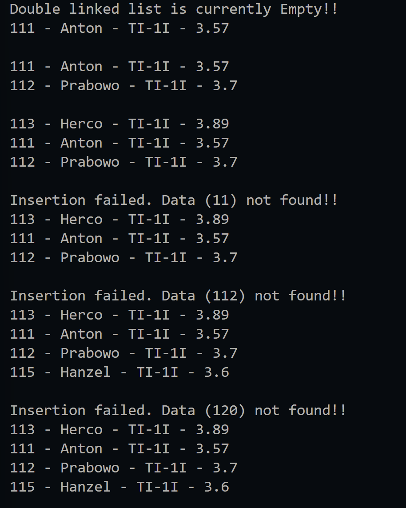
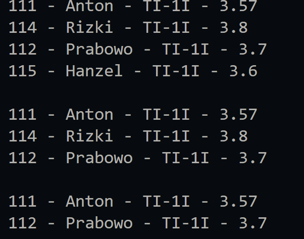

|  | Algorithm and Data Structure |
|--|--|
| NIM |  244107020023|
| Nama |  Dewi Chalissa Rania |
| Kelas | TI - 1I |
| Repository | [link] (https://github.com/ichaxpro/Algoritma-dan-Struktur-Data.git) |

# Labs #13 Double Linked List

## 2.1 Experiment 1 - Activity 1
### 2.1.2 Verification Experiment Result
The solution is implemented in Student.java, DoubleLinkedListMain.java, Node.java, and DoubleLinkedList.java. Below is screenshot of the result.




### 2.1.3 Question
*Brief explanaton:* 
1. Single Linked Lis has one pointer that point to the next node while double linked list has two pointer that point to the previous and the next node
2. - next = pointer that point to the next node and it will allows forward traversal 
- prev = to point the previous node and it allowed backward traversal
3. the purpose is to initialized the head and tail to be null when a new object created
4. it means that the if there is no data in linked list the new node bacame head and tail bacuse there is only one data.
5. this means we make the previous pointer of head to point to the newNode
6. make the next node of "current" previous pointer to point the newNode.
7. 
```java
    Node temp = head;
    while (temp != null) {
      if (temp.data.nim.equalsIgnoreCase(key)) {
        if (temp==tail) {
          addLast(data);
        }else{
          newNode.next = temp.next;
          newNode.prev = temp;
          temp.next.prev = newNode;
          temp.next = newNode;
          break;
        }
        return;
      }
      temp = temp.next;
    }
```
temp.next is used to move to the next node every iteration
8. so it's condition if the key that we need to find is the last data, the program will called the addLast method. I think we need to implement this code but I do think this is not the patent code to implement this. If we remove the code it will not handle tail updates manually.
9. to search the temp data that equals with the key that we input and after we find it we insert data after that. 


## 2.2.Experiment 2- Activity 2
### 2.2.3 Verification Experiment Result
The solution is implemented in Student.java, DoubleLinkedListMain.java, Node.java, and DoubleLinkedList.java. Below is screenshot of the result.




### 2.2.4 Question
1. - Move the head to the next node in a doubly linked list.
   - Set the new head’s prev pointer to null (since it’s now the first node).
2. because it's a condition where there is jut one node in double linked list, if we remove node without this code if we remove only one node, head or tail might still point to the deleted node
3. if there is no tail attribute in the code we need to traverse the list from head to find the last node
4. To check if the liked list is empty or not if it's empty the outpul will prit double liked list is currently empty
5. - index == 0 -> it means that the node we will remove is in index 0 so that's why we called removeFirst() method.
- temp == tail -> before this code we make temp = head and traverse from head if temp is tail or the last node we call the method removeLast()
6. 
```java
temp.prev.next = temp.next;
temp.next.prev = temp.prev;
```
this is the program toupdate the links when removing nodes form the middle
- temp.prev.next = temp.next; -> This sets the next pointer of the node before temp to point directly to the node after temp.
- temp.next.prev = temp.prev; -> This sets the prev pointer of the node after temp to point directly to the node before temp.
7. 
``` java
package Jobsheet13;

public class DoubleLinkedList {
  Node head, tail;
  int size;

  public DoubleLinkedList(){
    head= null;
    tail = null;
  }
  public boolean isEmpty(){
    return head == null;
  }

  public void addFirst(Student data){
    Node newNode = new Node(data);
    if (isEmpty()) {
        head = tail = newNode;
    } else {
        newNode.next = head;
        head.prev = newNode;
        head = newNode;
    }
    size++; 
}


  public void addLast(Student data){
    Node newNode = new Node(data);
    if (isEmpty()) {
        head = tail = newNode;
    } else {
        tail.next = newNode;
        newNode.prev = tail;
        tail = newNode;
    }
    size++; 
 }


  public void insertAfter(String key, Student data){
    Node newNode = new Node(data);
    Node temp = head;
    while (temp != null) {
      if (temp.data.nim.equalsIgnoreCase(key)) {
        if (temp==tail) {
          addLast(data);
        }else{
          newNode.next = temp.next;
          newNode.prev = temp;
          temp.next.prev = newNode;
          temp.next = newNode;
          size++;
          break;
        }
        return;
      }
      temp = temp.next;
    }
    if (temp == null) {
      System.out.println("Insertion failed. Data ("+key+") not found!!");
    }
  }

  void print(){
    if (!isEmpty()) {
      Node temp = head;
      while (temp != null) {
        temp.data.print();
        temp = temp.next;
      }
      System.out.println("");
    }else{
      System.out.println("Double linked list is currently Empty!!");
    }
  }

  public void removeFirst(){
    if (isEmpty()) {
        System.out.println("Double Linked List is currently empty!!");
    } else if (head == tail) {
        head = tail = null;
    } else {
        head = head.next;
        head.prev = null;
    }
    size--; 
}


  public void removeLast(){
    if (isEmpty()) {
        System.out.println("Double linked list is currently empty!!");
    } else if (head == tail) {
        head = tail = null;
    } else {
        tail = tail.prev;
        tail.next = null;
    }
    size--; 
}


  public void remove(int index) {
    if (index < 0) {
        System.out.println("Index is negative!!");
    } else if (index >= size) {
        System.out.println("Index exceeds the size of the list!!");
    } else {
        if (isEmpty()) {
            System.out.println("Double Linked List is currently empty!!");
        } else if (index == 0) {
            removeFirst();
        } else {
            Node temp = head;
            for (int i = 0; i < index; i++) {
                temp = temp.next;
            }
            if (temp == tail) {
                removeLast();
            } else {
                temp.prev.next = temp.next;
                temp.next.prev = temp.prev;
            }
        }
        size--;
    }
}

}

```


## 2.3 Assignment
### 2.3.1 Verification Experiment Result
The solution is implemented in Student.java, DoubleLinkedList.java, DoubleLinkedListMain.java, and Node.java. Here's the screenshot of the result.

```java
System.out.println("--------------------");
    dll.print();
    dll.addFirst(new Student("111", "Anton", "TI-1I", 3.57));
    System.out.println("--------------------");
    dll.print();
    dll.addLast(new Student("112", "Prabowo", "TI-1I", 3.7));
    System.out.println("--------------------");
    dll.print();
    dll.addFirst(new Student("113", "Herco", "TI-1I", 3.89));
    System.out.println("--------------------");
    dll.print();
    dll.insertAfter("111", new Student("114", "Rizki", "TI-1I", 3.8));
    System.out.println("--------------------");
    dll.print();
    dll.insertAfter("112", new Student("115", "Hanzel", "TI-1I", 3.6));
    System.out.println("--------------------");
    dll.print();
    dll.insertAfter("120", new Student("116", "Eiyu", "TI-1I",3.4));
    System.out.println("--------------------");
    dll.print();
    dll.add(3, new Student("134", "Icha", "TI-1I",3.4));
    System.out.println("----------------------------------------");
    dll.getFirst().print();
    dll.getLast().print();
    dll.getIndex(2);
    dll.removeFirst();
    System.out.println("--------------------");
    dll.print();
    dll.removeLast();
    System.out.println("--------------------");
    dll.print();
    dll.remove(1);
    System.out.println("--------------------");
    dll.print();
    System.out.println("Double Linked List size: " + dll.size);
    dll.indexOf("134");
```
.png)
.png)


