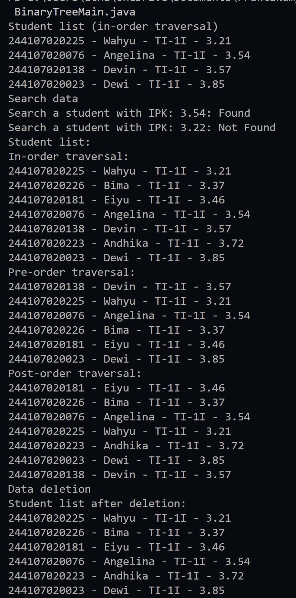
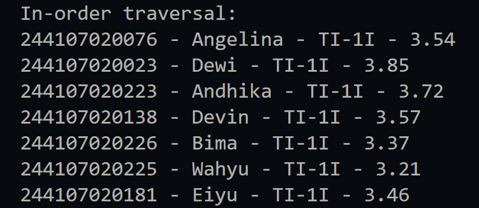
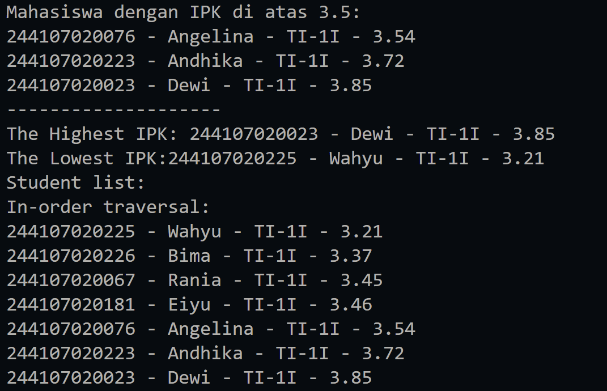
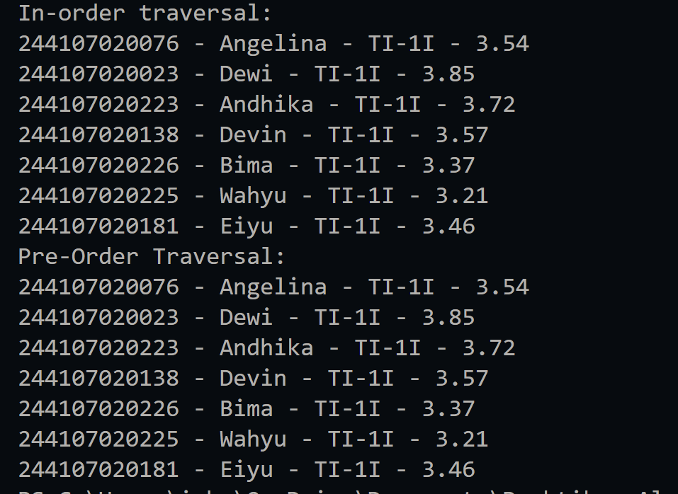

|  | Algorithm and Data Structure |
|--|--|
| NIM |  244107020023|
| Nama |  Dewi Chalissa Rania |
| Kelas | TI - 1I |
| Repository | [link] (https://github.com/ichaxpro/Algoritma-dan-Struktur-Data.git) |

# Labs #14 Tree

## 14.2 Experiment 1 - Implementation of Binary Search Tree Using Linked List
### 14.2.1 Verification Experiment Result
The solution is implemented in Student08.java, BinaryTreeMain.java, Node.java, and BinaryTree.java. Below is screenshot of the result.

### 14.2.2 Question
*Brief explanaton:* 
1. A binary search tree (BST) is structured so that all nodes follow a specific ordering rule:
    - Left subtree contains nodes with values less than the parent node.
    - Right subtree contains nodes with values greater than the parent node.
2. left and right attributes serve as pointer of node, pointer is used to store reference addresses that point to other nodes in the list and connect nodes together.
3. - The root attribute in a binary tree serves  as the entry point to the entire tree structure.
   -  the initial wavlue of root is null  
4. if tree is empty, the new node will be the root and the process that handle this is add() and inside the condition if isEmpty()
5. In the following code, we will compare the new node's ipk and current's ipk, if the new node's ipk is less than current's ipk it will move to the left child while if the new node's ipk is bigger than current's ipk it will move to the right child
6. - When deleting a node with two children, it requires a replacement node.
    - The method finds the successor node, which is the smallest value in the right subtree.
    - getSuccessor() helps by identifying and replacing the deleted node.
    - The successor node maintains BST ordering while ensuring no orphaned children exist.

## 14.3. Experiment 2- Implementation of Binary Tree Using Array
### 14.3.1 Verification Experiment Result
The solution is implemented in Student08.java, BinaryTreeArray08.java, and BinaryTreeArrayMain08.java. Below is screenshot of the result.

### 14.3.2 Question
1. data is a array that store the object of Student00 while idxLast store the last index of array
2. populateData() is used to initializes the array with predefined tree nodes.
3. To display the binary tree from left to root and then to right
4. - Left child: 2 * idx + 1 = 5
    - Right child: 2 * idx + 2 = 6
5. It ensures the program correctly identifies the last node in the array.
6. - This formula maps tree structure onto an array:
Parent at index i → Left child at 2*i + 1, Right child at 2*i + 2.
    - This maintains correct hierarchical relationships in an array-based representation.

## 14.4 Assignment
### 14.4.1 Verification Experiment Result
The solution is implemented in Student08.java, BinaryTree.java, BinaryTreeArray08.java, BinaryTreeMain.java, BinaryTreeArrayMain08.java, and Node.java. Here's the screenshot of the result.

