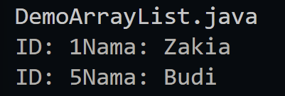
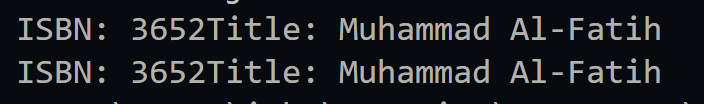
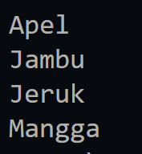
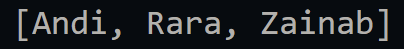

|  | Algorithm and Data Structure |
|--|--|
| NIM |  244107020023|
| Nama |  Dewi Chalissa Rania |
| Kelas | TI - 1I |
| Repository | [link] (https://github.com/ichaxpro/Algoritma-dan-Struktur-Data.git) |

# Labs #15 Collection

## 15.2 Persiapan 
## 15.3. Praktikum- Implementasi ArrayList
3. 
5. The new object is being place at the bottom.

7. ArrayList index is start at 0
.png)
8. Based on the output customer 2 at index 1
.png)
9. .png)
10. When I deleted number 2, the output stilll the same so I think it's okay if we dont specify the size at the beginning
.png)
11. .png)
12. .png)

## 15.4 Praktikum - Implementasi Stack
4.  
5. Checking (temp != null) ensures that the stack isn't empty before accessing its elements
6. .png)
7. .png)
8. 
``` java
int temp3 = books.search(book1);
    if (temp3 != -1) {
      System.out.println("Buku " +book1.title+ " ditemukan di posisi ke-" + temp3 + " dari atas stack.");
    } else {
      System.out.println("Buku tidak ditemukan.");
    }
```
.png)

## 15.5 Praktikum - Implementasi TreeSet
4. Because TreeSet in java automatically sorting it ascending lexicographical order.

6. - First(): display the first data
    - Last(): display the last data
    - remove(): remove data based on the inside paramater
    - pollfirst(): get the first data (smallest) and remove it
    - pollLast(): get the last data (biggest) and remove it


# 15.6 Praktikum - Sorting

