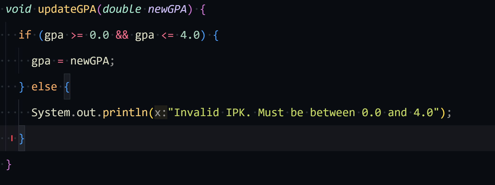
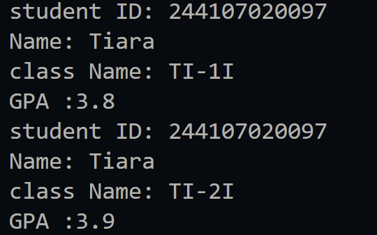
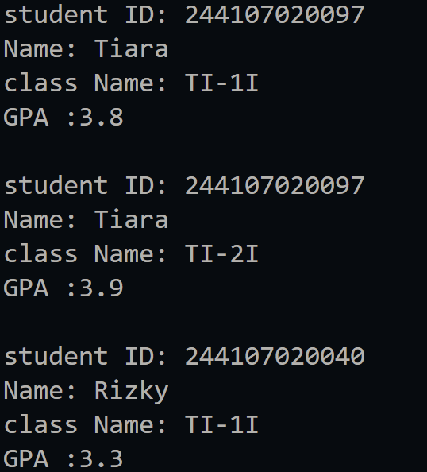
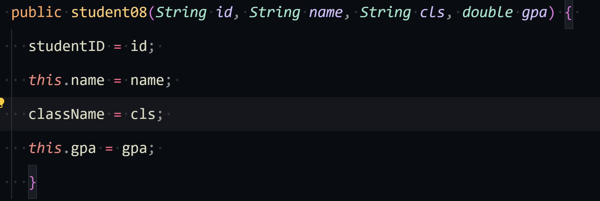
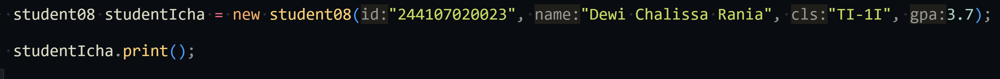
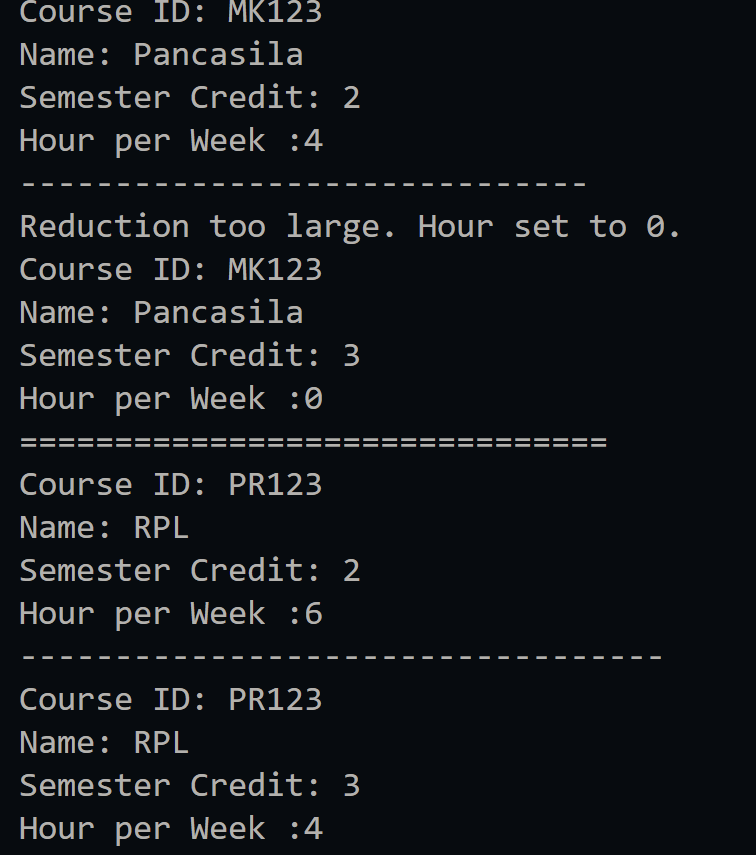
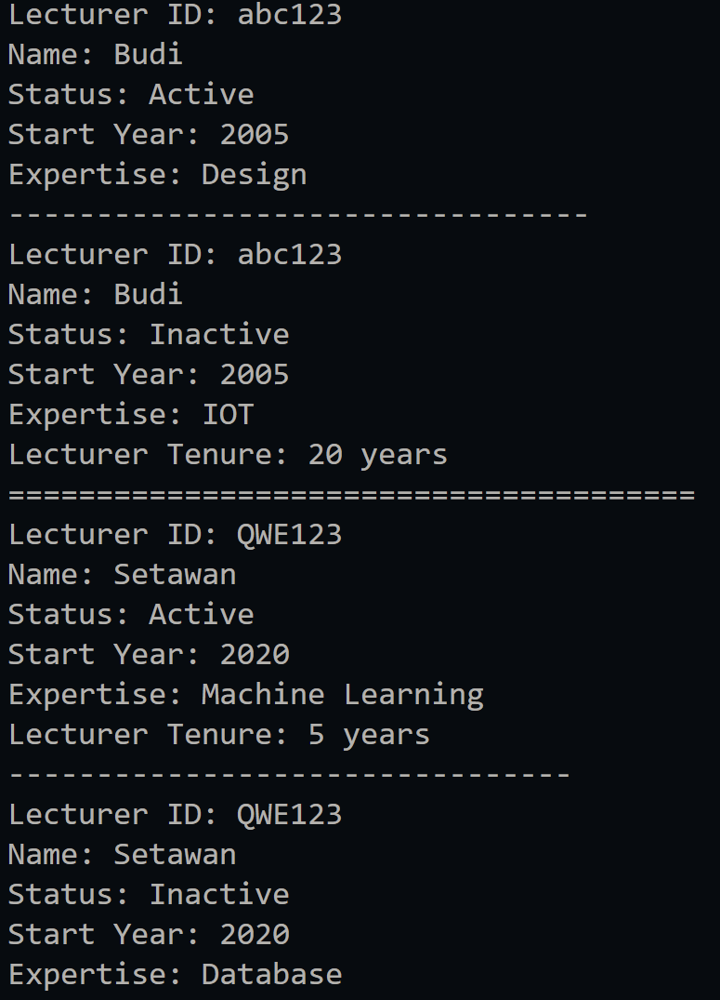

|  | Algorithm and Data Structure |
|--|--|
| NIM |  244107020023|
| Nama |  Dewi Chalissa Rania |
| Kelas | TI - 1I |
| Repository | [link] (https://github.com/ichaxpro/Algoritma-dan-Struktur-Data.git) |

# Labs #1 Programming Fundamentals Review

## 2.1 Experiment 1 Solution
### 2.1.2 Verification Experiment Result
The solution is implemented in student08.java, and below is screenshot of the result.

### 2.1.3 Question
*Brief explanaton:* 
1. - Object: Can be created many times and specific
   - Class: can be declared only once and general
2. There are 4 attribute in student08 class:
   - Student ID
   - Name
   - Class Name
   - GPA
3. There are 4 method in student08 class:
   - print student identity
   - Change Class Name
   - Update GPA
   - Evaluate the GPA
4. 
5. The evaluate() method  evaluated student performance based on their GPA (Grade Point Average) and categorizes it into four different performance levels: "Excellent," "Good," "Fair," and "Poor."

## 2.2 Experiment 2 Solution
### 2.2.2 Verification Experiment Result
The solution is implemented in studentMain08.java, and below is screenshot of the result.

### 2.2.3 Question
*Brief explanaton:* 
1. 
The name of object in experiment 2 is student1
2. We can acces attributes or method of an object by calling it after object. For example, student1 as object and print() as method, we can acces it by doing student1.print();  
3. Because in the second calls to print(), we have called the method of changeClass and updateGPA. So, that's why the output is different.

## 2.3 Experiment 3 Solution
### 2.3.2 Verification Experiment Result
The solution is implemented in studentMain08.java, and below is screenshot of the result.

### 2.3.3 Question
*Brief explanaton:* 
1. 
The name of object in experiment 2 is student1
2. We can acces attributes or method of an object by calling it after object. For example, student1 as object and print() as method, we can acces it by doing student1.print();  
3. Because in the second calls to print(), we have called the method of changeClass and updateGPA. So, that's why the output is different.

## 2.3 Experiment 2 Solution
### 2.3.2 Verification Experiment Result
The solution is implemented in studentMain08.java, and below is screenshot of the result.

### 2.3.3 Question
*Brief explanaton:* 
1. 

2. It means that we called the constructor from student08 class that receives 4 parameters:
  - "244107020040" → Student ID
  - "Rizky" → Name
  - "TI-1I" → Class Name
  - 3.5 → GPA 
3. The studentMain08 file will be error because there is an instantiation of object without parameter. This happens because when we remove the default constructor from the Student class, Java no longer provides an implicit no-argument constructor. Therefore, every object instantiation must explicitly pass the required parameters. If an object is created without parameters, the program will fail to compile.
4. After instantiating an object, methods do not have to be accessed in order. They can be called in any sequence as per the program's needs.
5. 

## 2.4 Assignments
### 2.4.1 Assignment 1 
this is the implementation from assignment1.java and assignment1Main.java

This code defines **two classes**:  

1. **`assignment1`** (main class)  
   - Stores course information: `courseID`, `name`, `credit`, `hour`.  
   - Has **two constructors** (default and with parameters).  
   - Methods:  
     - `print()`: Displays course details.  
     - `changeCredit(int newCredit)`: Changes the credit value.  
     - `addHour(int hours)`: Adds course hours with validation.  
     - `reduceHour(int reduces)`: Reduces course hours with validation.  

2. **`assignment1Main`** (execution class)  
   - Creates two objects (`course1` and `course2`).  
   - Sets and displays course information.  
   - Modifies hours and credits using the provided methods.  

### 2.4.2 Assignment 2
This is the implementation of lecturer08.java and lecturer08Main.java

This code defines **two classes**:  

1. **`lecturer08` (Main Class)**  
   - Stores lecturer details (`ID`, `name`, `status`, `startYear`, `expertise`).  
   - Methods:  
     - `print()`: Displays details.  
     - `setStatus()`: Updates status.  
     - `calculateTenure()`: Calculates years of service.  
     - `changeExpertiseField()`: Updates expertise.  

2. **`lecturer08Main` (Execution Class)**  
   - Creates and modifies lecturer objects.  
   - Updates expertise and status.  
   - Calculates and prints tenure.  

