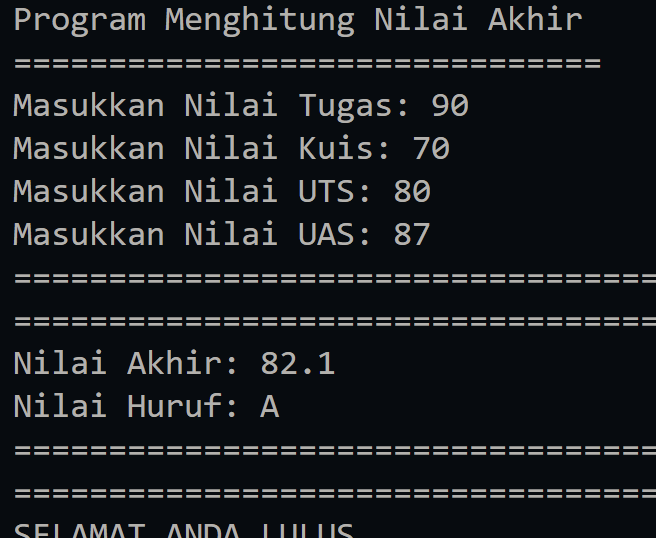
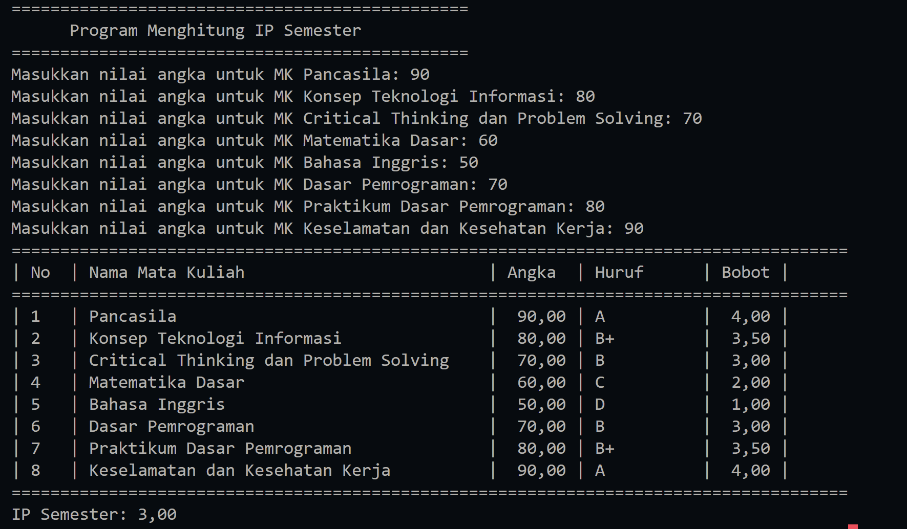
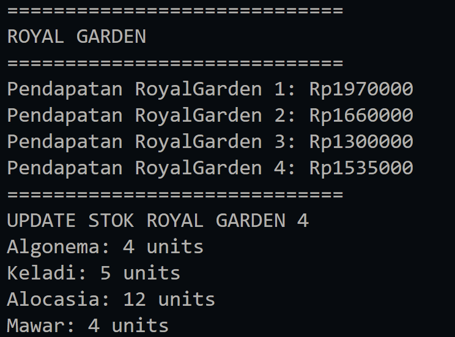
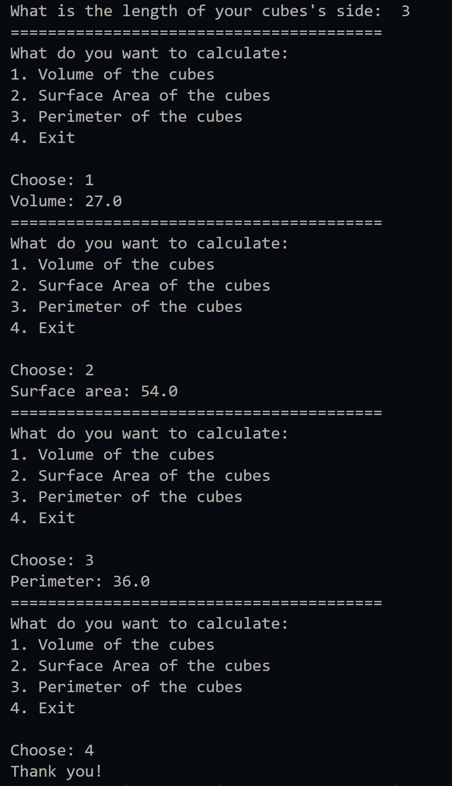

|  | Algorithm and Data Structure |
|--|--|
| NIM |  244107020023|
| Nama |  Dewi Chalissa Rania |
| Kelas | TI - 1I |
| Repository | [link] (https://github.com/ichaxpro/Algoritma-dan-Struktur-Data.git) |

# Labs #1 Programming Fundamentals Review

## 2.1.1. Selection Solution

The solution is implemented in selection.java, and below is screenshot of the result.

*Brief explanaton:* There are 4 main step: 
1. Input all grades
2. Validate the input
3. Calculate and convert the final grade
4. Decide the final status

## 2.2.1. Looping Solution
The solution is implemented in looping.java, and below is screenshot of the result.

*Brief explanaton:* There are 4 main step: 
1. Input NIM
2. Take the last two digits of NIM (n)
3. Print number from 1 to n except 6 and 10
4. Print odd numbers as an asterisk ("*"), while even numbers are printed as themselves.

## 2.3.1. Array Solution
The solution is implemented in array.java, and below is screenshot of the result.

*Brief explanaton:* There are 4 main step: 
1. Input all grades
2. Convert the grade into numerical and weight
3. Print table of grade
4. Calculate IP

## 2.4.1. Function Solution
The solution is implemented in function.java, and below is screenshot of the result.

*Brief explanaton:* There are 3 main step: 
1. Define flower, stock, and prices 
2. Calculate revenue for each branch
3. Update stock in branch 4

## 3.1.1. Assignment 1 Solution
The solution is implemented in assignment1.java, and below is screenshot of the result.

*Brief explanaton:* There are 3 main step: 
1. Input the plate code
2. Matching plate code to city
3. Display the result

## 3.2.1. Assignment 2 Solution
The solution is implemented in assignment2.java, and below is screenshot of the result.

*Brief explanaton:* There are 3 main step: 
1. Input the side of the cubes
2. Display the menu: calculate volumes, surface area, and perimeter
3. Display the result based on the menu that has been chosen

## 3.3.1. Assignment 3 Solution
The solution is implemented in assignment3.java, and below is screenshot of the result.

.png)
.png)
.png)

*Brief explanaton:* There are 4 main step: 
1. Display Main Menu
2. Input the menu choice
3. Execute the chosen menu
4. Program will repeat the process until the user choose to exit.