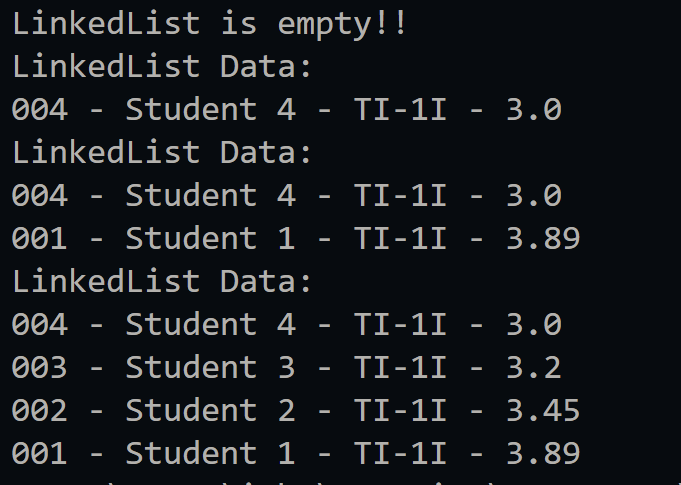
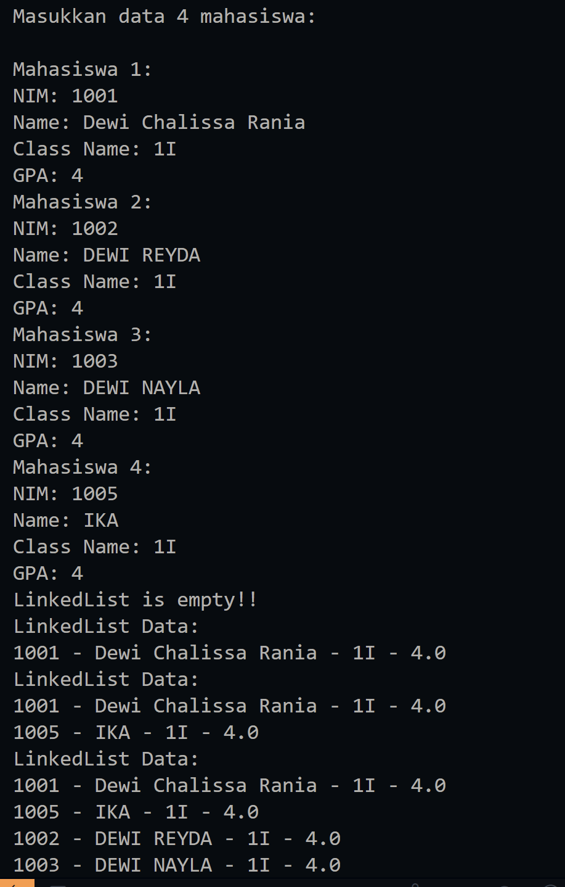
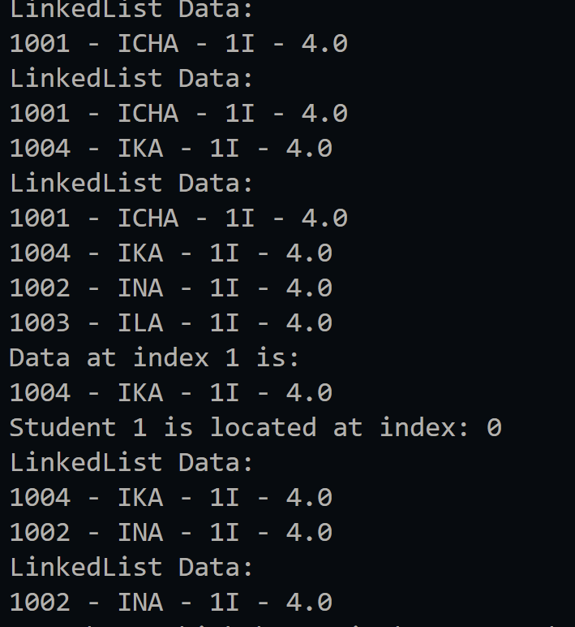
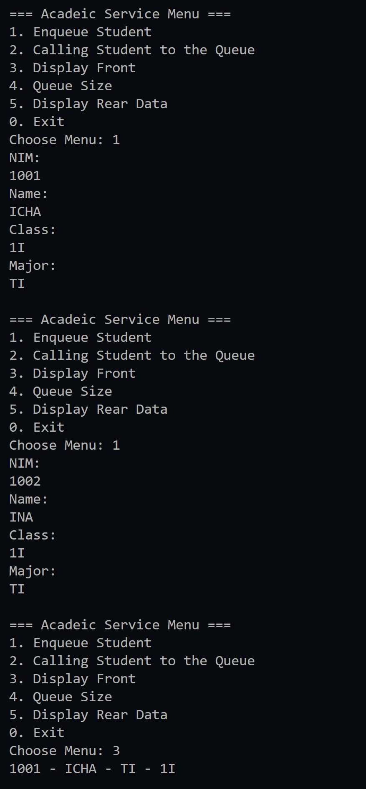

|  | Algorithm and Data Structure |
|--|--|
| NIM |  244107020023|
| Nama |  Dewi Chalissa Rania |
| Kelas | TI - 1I |
| Repository | [link] (https://github.com/ichaxpro/Algoritma-dan-Struktur-Data.git) |

# Labs #12 Linked List

## 2.1 Experiment 1 - Implementing Single Linked List
### 2.1.2 Verification Experiment Result
The solution is implemented in SingleLinkedList.java, main.java, Student08.java, and Node.java. Below is screenshot of the result.

### 2.1.3 Question
*Brief explanaton:* 
1. Because in the main.java the first method that will execute is print(), and because there is no data in linkedlist the output will print LInkedList is empty.
2. the variable temp is used as a temporary pointer to traverse or manipulated the linked list without modifying the head or tail directly
3. 
4. - Method addLast() = if we remove the tail we need to traberse the emtire list from head to find the last node
- removeLast() = if we removed the tail variable we cant directly update tail bacause it doesnt exist

## 2.2.Experiment 2- Accessing Element in Single Linked List
### 2.2.3 Verification Experiment Result
 Below is screenshot of the result.

### 2.2.4 Question
1. break statement is used to stop the loop once the node matching the given key (the student's name) has been found and removed.
2. This code is responsible for removing a node from the middle or end of the linked list.

## 2.3 Assignment
### 2.3.1 Verification Experiment Result
The solution is implemented in Student.java, StudentQueue.java, NodeAssignment.java, and StudentMain.java. Here's the screenshot of the result.

.png)
.png)

