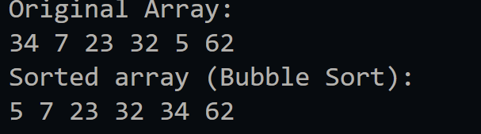
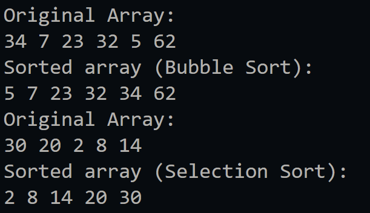
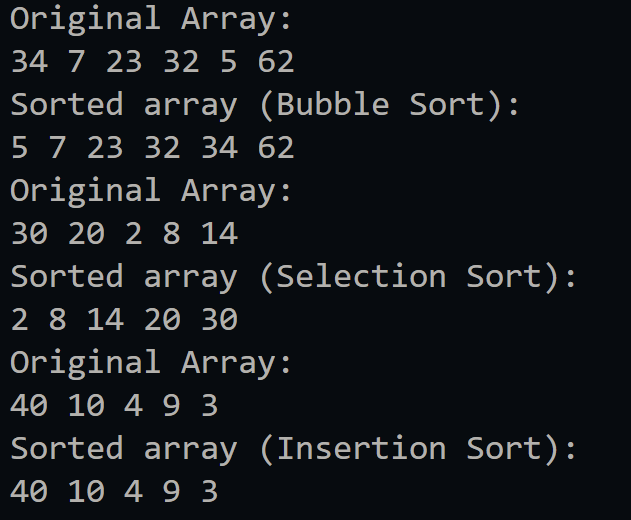
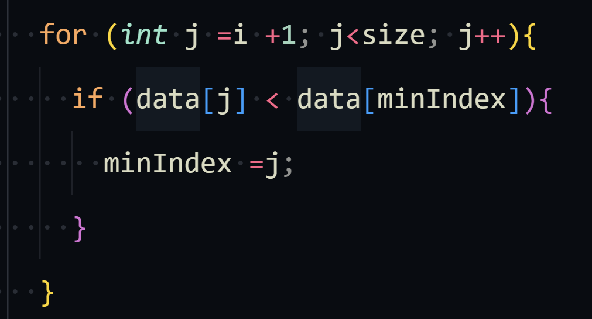
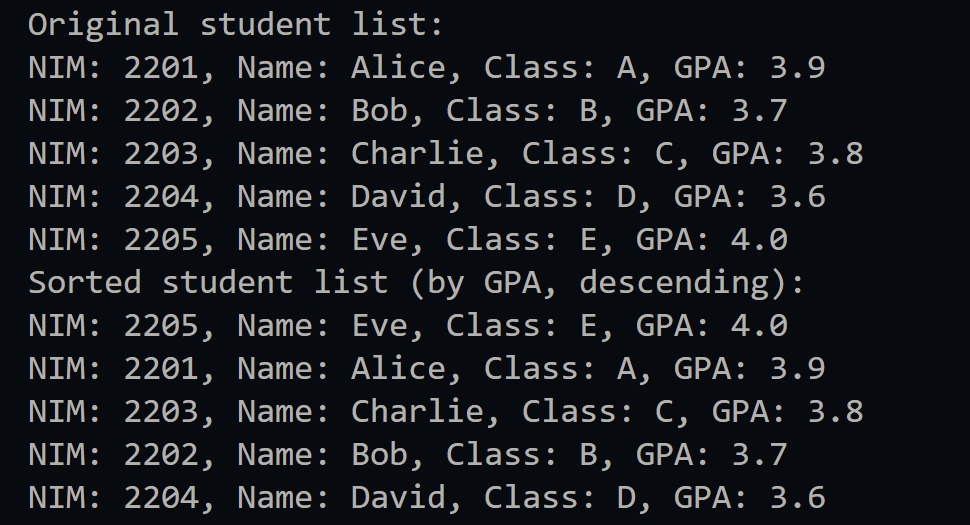
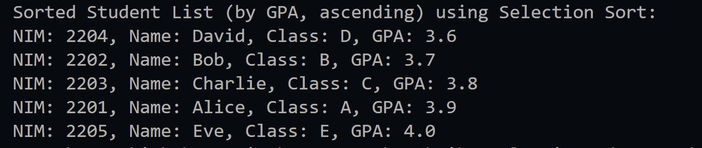
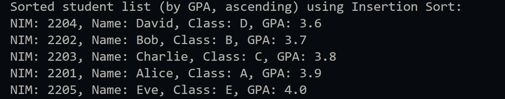
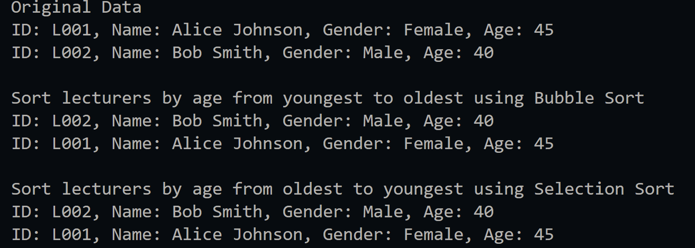

|  | Algorithm and Data Structure |
|--|--|
| NIM |  244107020023|
| Nama |  Dewi Chalissa Rania |
| Kelas | TI - 1I |
| Repository | [link] (https://github.com/ichaxpro/Algoritma-dan-Struktur-Data.git) |

# Labs #1 Programming Fundamentals Review

## 6.2 Experiment 1 - Implementing Sorting Using Objects
### 6.2.2 Verification Experiment Result
The solution is implemented in sorting08.java, and sortingMain08.java. Below is screenshot of the result.



### 6.2.3 Verification Experiment Result
The solution is implemented in sorting08.java, and sortingMain08.java. Below is screenshot of the result.



### 6.2.4 Verification Experiment Result
The solution is implemented in sorting08.java, and sortingMain08.java. Below is screenshot of the result.



### 6.2.5 Question
*Brief explanaton:* 
1.  This code's purpose is to performs bubble sort, we compare rwo element that next to each other. If the data[j] value is greater than data[j+1], we swap data[j] with data[j+1].
2. 
Inside this loop, the code compares data[j] with the current minimum data[minIndex] an dif the data[j] is smaller it will ypdates minIndex to j
3. This condition is to check that j is start at 0 so that it stays inside the array and also checks if data[j] is bigger than key or as we know data[i].
4. It shifts the value of data[j] to the data[j+1]

## 6.3.Experiment 2- Sorting Using an Array of Objects
### 6.3.3 Verification Experiment Result
The solution is implemented in student08.java, studentDemo08.java, topStudent08.java. Below is screenshot of the result.



### 6.3.4 Question
1. a). To make sure that the  looping is stay inside the array and all elements are compared.
   b). To reduce the range each time because because after each pass, the largest GPA will swap up to the front
   c). The loop will executes about 49 times and 49 stages of bubble sort will be performed
2. This Java program allows users to input student data (NIM, Name, Class, GPA), store them in an array, and sort the students based on GPA in descending order.

### Code Example

```java
package week06;
import java.util.Scanner;

public class studentDemo08 {
  
  public static void main(String[] args) {
    Scanner sc = new Scanner(System.in);
    System.out.print("How many students do you want to input? ");
    int input = sc.nextInt();
    sc.nextLine(); // Clear buffer

    topStudent08 topStudents = new topStudent08(input);

    for (int i = 0; i < input; i++) {
        System.out.println("\nEnter data for Student " + (i + 1) + ":");
        System.out.print("NIM: ");
        String nim = sc.nextLine();
        System.out.print("Name: ");
        String name = sc.nextLine();
        System.out.print("Class: ");
        String studentClass = sc.nextLine();
        System.out.print("GPA: ");
        double gpa = sc.nextDouble();
        sc.nextLine(); 

        student08 student = new student08(nim, name, studentClass, gpa);
        topStudents.add(student); 
    }

    // Display original list
    System.out.println("Original student list:");
    topStudents.print();

    // Sorting students by GPA using Bubble Sort
    topStudents.bubbleSort();
    System.out.println("Sorted student list (by GPA, descending):");
    topStudents.print();
  }
}

```

### 6.3.5 Sorting Student Data Based on GPA (Selection Sort)

### 6.3.8 Verification of Experiment Results



### 6.3.9 Question
*Brief explanaton:* 
1. This code is to find the minimum value of index in array, it comares each element's gpa with the current minimum (minIndex). If a smaller value is found, it will updateminIndex to j. 

### 6.3.10 Sorting Student Data Based on GPA Using Insertion Sort

### 6.3.12 Verification of Experiment Results


### 6.3 13 Question
```java
public void insertionSort(){
    for (int i =1; i<idx; i++){
      student08 temp = listStudent08s[i];
      int j = i;

      while(j > 0 && listStudent08s[j-1].gpa < temp.gpa){
        listStudent08s[j] = listStudent08s[j-1];
        j--;
      } 
      listStudent08s[j] = temp;
    }
  }
  ```
## 6.4 Assignment
### 6.4.1 Verification Experiment Result
The solution is implemented in lecturer08.java, lecturerData08.java, and lecturerDemo.java. Here's the screenshot of the result.




This code defines **three classes**:  

1. **`lecturerDemo`** (main class)  
   -  Acts as the main method.
   -  Creates an instance of LecturerData to store lecturer objects.
   - Adds lecturer data using the add() method.
   - Calls the print() method to display all lecturer information

2. **`lecturerData08`** (method)  
   - contains method that will be executed in main method
   - Methods include:
      - add(Lecturer dsn): add lecturer to lecturerData Array
      - print(): Display all data
      - sortingASC(): Sort lecturers by age from youngest to oldest using Bubble Sort.
      - sortingDSC(): Sort lecturers by age from oldest to youngest using Selection Sort
3. **`lecturer08`** (attribute)
   - Represents a lecturer with attributes:
      - id (String) → Unique lecturer identifier.
      - name (String) → Lecturer’s name.
      - gender (boolean) → true for male, false for female.
      - age (int) → Lecturer’s age.
   - Contains a constructor to initialize lecturer objects.


