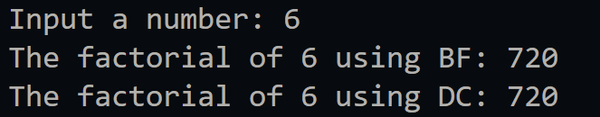
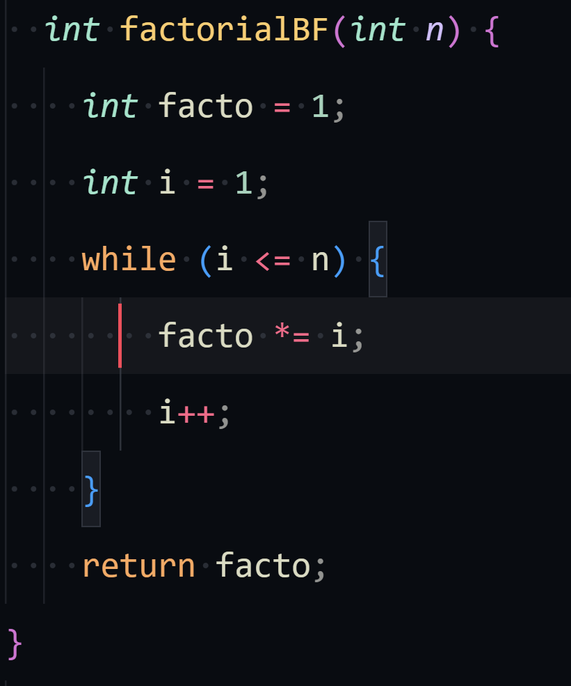
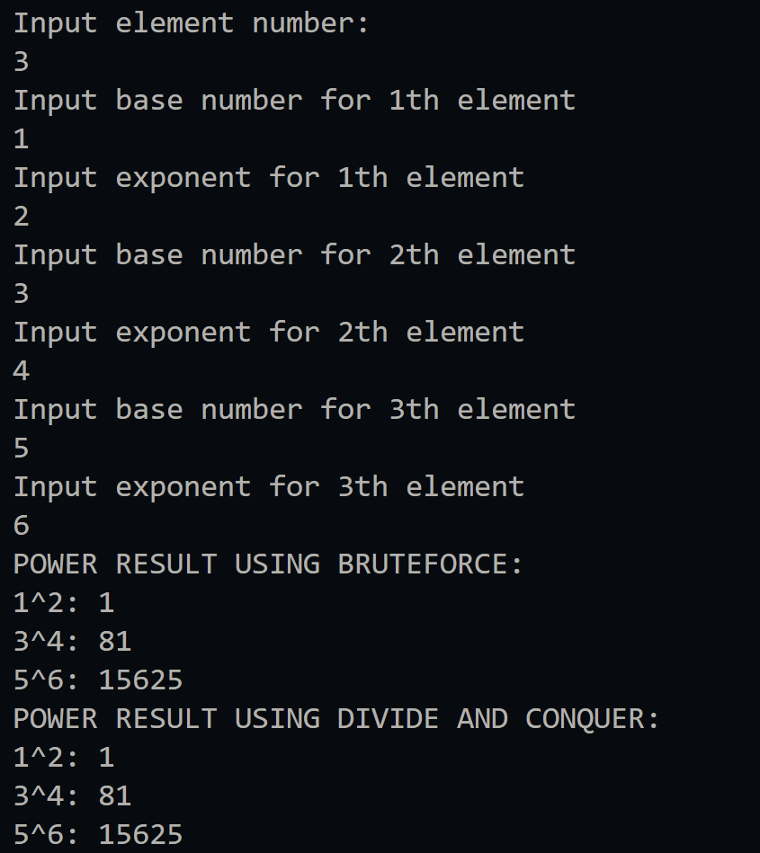
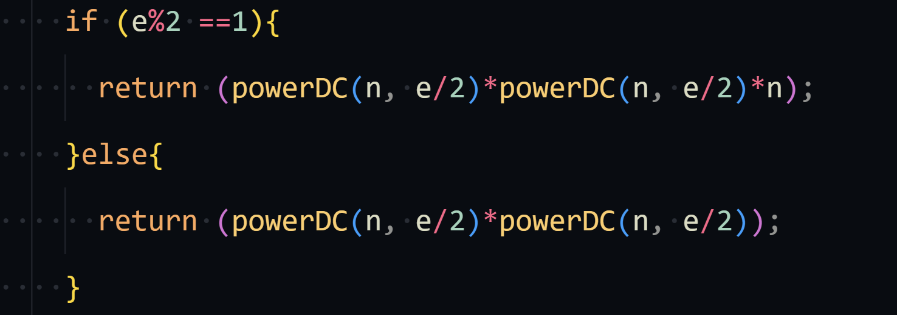
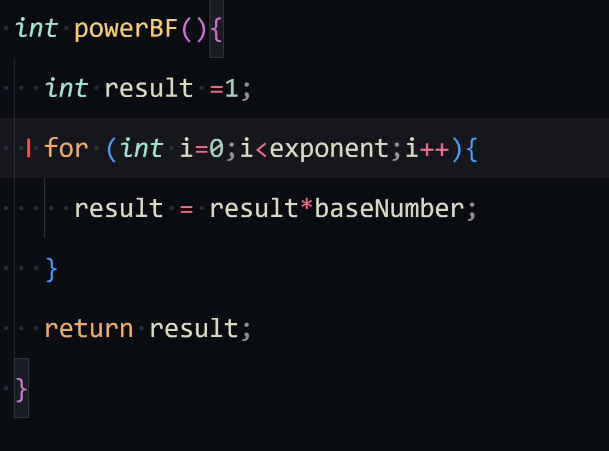
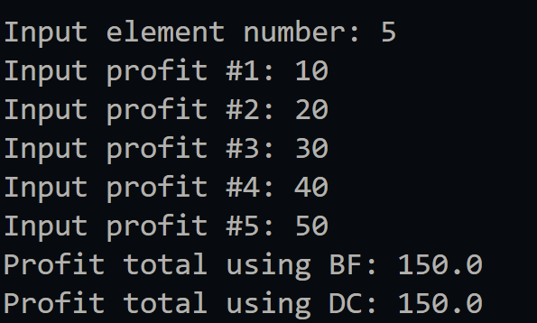
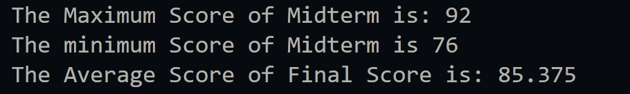

|  | Algorithm and Data Structure |
|--|--|
| NIM |  244107020023|
| Nama |  Dewi Chalissa Rania |
| Kelas | TI - 1I |
| Repository | [link] (https://github.com/ichaxpro/Algoritma-dan-Struktur-Data.git) |

# Labs #1 Programming Fundamentals Review

## 5.2  Calculating Factorial Using Brute Force and Divide and Conquer Algorithms
### 5.2.2 Verification Experiment Result
The solution is implemented in factorial.java and mainFactorial.java Below is screenshot of the result.

### 5.2.3 Question
*Brief explanaton:* 
1. if else in the code structure is a part of recursive function. Recursive function is a function that solves a problem by solving smalles instances of the same problem.
   - if : Base Case, a condition where the recursion function stop
   - else: Recursion, this is where the recursion function is placed  
2. Yes, it is possible, we can use loop while(condition). To implement this we can just change the form of for loop to while loop. it will be like this:
int 

3. The difference is method they used to solve the problem.
   - facto = facto * i; = using iterative approach that is usually used inside loop
   - int facto = n * factorialDC(n - 1); : Recursive Approach, this is used inside a recursive function.
4. - factorialBF(): using iterative approach that usually used by looping. This method updates a variable step by step until it reaches the desired factorial value.
   - factorialDC(): using recursive approach that usually used by recursive function. It called the function itself until the base case condition fullfiled.

## 5.3 Calculating Exponentiation Using Brute Force and Divide and Conquer Algorithms
### 5.3.2 Verification Experiment Result
The solution is implemented in power.java and powerMain.java, and below is screenshot of the result.

### 5.3.3 Question
*Brief explanaton:* 
1. - powerBF(): Uses for loop to repeatedly multiply n by itself e times
   - powerDC(): Uses recursion to divide the exponent into smaller parts until it reaches the base case.
2. The combined stages is where the result of the recursive calls are multiplied together. The relevant part of the code is 

3. Yes, the parameters in powerBF are not really necessary because the power class has attributes, and the method could be rewritten without parameters using the class attributes instead. But using parameter will allows the user to calculate powers of different numbers without creating new object.

## 5.4 Calculating Array Sum Using Brute Force and Divide and Conquer Algorithms
### 5.4.2 Verification Experiment Result
The solution is implemented in sum.java and sumMain.java. Below is screenshot of the result.

### 5.4.3 Question
*Brief explanaton:* 
1. Mid is needed because to split the array into 2 halves, and it makes the problem into two smaller subproblem
2. Its where the recursion method placed
3. it is necessary because it is the combine stage after we use the method divide and conquer
3. the base case of totalDC method is if the value of l and r is the same, and if it sam it will return an array with element l.
4. Method totalDC is used to calculate sum of element array using the divide and conquer approach. The function first checks if l is equal to r, meaning there is only one element left in the current range. If so, it returns that element. Otherwise, it calculates the middle index mid by taking the average of l and r. The function then recursively calls itself to compute the sum of the left half (totalDC(arr, l, mid)) and the right half (totalDC(arr, mid + 1, r)). Finally, it returns the total sum by adding the results of both recursive calls. This process continues until all elements are summed up. However, there is an error in the given code where arr[1] is incorrectly used instead of arr[l]. Once corrected, the method effectively breaks the problem into smaller subproblems, solves them recursively, and combines the results to obtain the total sum of the arra
## 5.5 Assignments
### 5.5.1 Verification Experiment Result
The solution is implemented in grades.java and gradesMain.java Here's the screenshot of the result.

This code defines **three classes**:  

1. **`gradesMain`** (main class)  
   -  Acts as the main method.
   - Connect the data and method from class grades.
   - Display the data so that the user can see the the result of the method that we use in class grades, like the average score, maximum score, and minimum score

2. **`lecturerData08`** (method)  
   - contains method that will be executed in main method
   - Methods include:
      - findMaxMidtermScore(): Find the maximum score of midterm test.
      - FindMinMidtermScore(): Find the minimum score of midterm test.
      - averageFinalScore(): Calculates the average grades of Final test.
   - Use the method divide and conquer to find the maximum and minimum score. Meanwhile we use method brute force to calculate the average score of final test.
